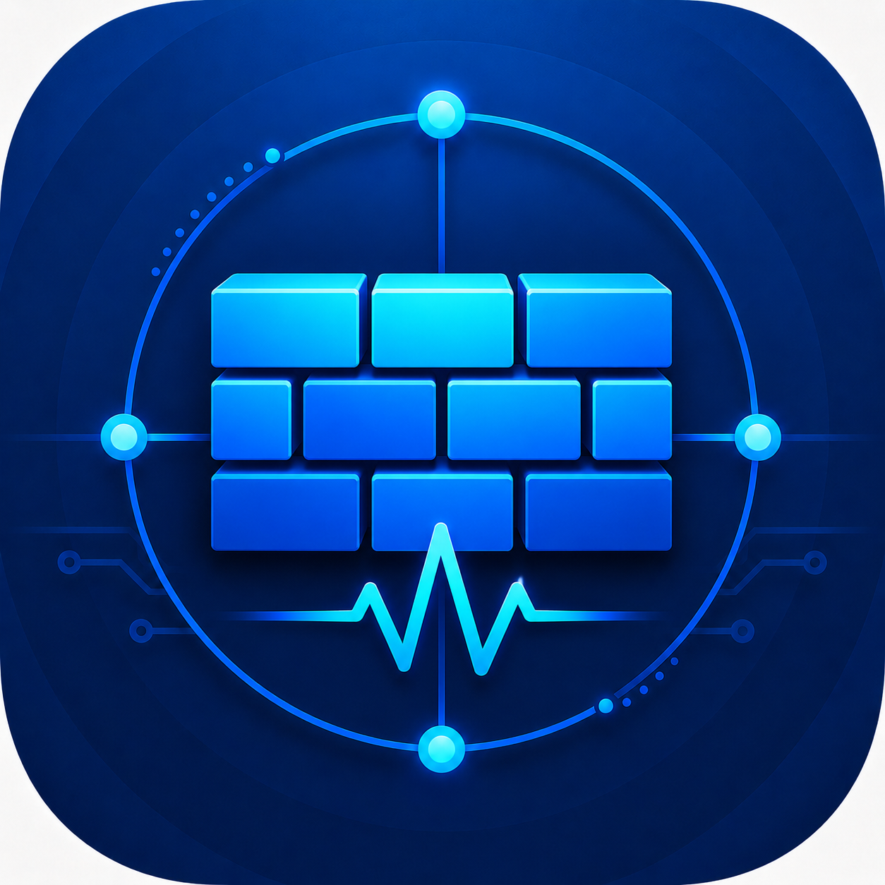
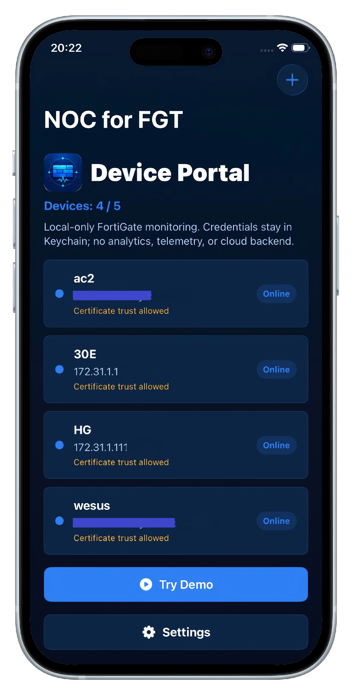

<div align="center">



# NOC for FGT

**Your FortiGate NOC, in your pocket.**  
**把 FortiGate 运维视图放进口袋里。**

A local-first iPhone and iPad companion app for FortiGate monitoring, diagnostics, trends, interfaces, and operational visibility.

一款面向 iPhone 和 iPad 的 FortiGate 本地直连监控与运维辅助应用，专注设备状态、诊断、趋势、接口和日常运维可见性。

<br>

[](https://fgt.opshome.run/)
[](https://fgt.opshome.run/)
[](https://fgt.opshome.run/)
[](https://fgt.opshome.run/)

<br>

[English](#english) · [简体中文](#简体中文) · [Privacy](https://fgt.opshome.run/privacy.html) · [Terms](https://fgt.opshome.run/terms.html)

<br>



</div>

---

## English

### Overview

**NOC for FGT** is a focused FortiGate monitoring companion for IT administrators, network operators, firewall administrators, and homelab users who want practical device visibility from iPhone or iPad.

The app connects directly to FortiGate devices configured by the user and presents common operational information without requiring a separate NOC for FGT cloud account.

### Highlights

| Capability | Description |
| --- | --- |
| **System health** | Review CPU, memory, active sessions, uptime, model, FortiOS version, and build information. |
| **Interface monitoring** | View interface status, roles, IP information, WAN traffic, and parent / child relationships where available. |
| **Historical trends** | Review CPU, memory, sessions, and traffic trends based on available local samples and device support. |
| **Network topology** | Understand interface and VLAN relationships through topology-oriented views. |
| **Multiple FortiGate devices** | Keep multiple configured FortiGate devices organized in one mobile workspace. |
| **2FA support** | Use FortiToken / OTP-based authentication when enabled on the FortiGate account. |
| **Diagnostics** | Inspect supported API, endpoint, and connection behavior while troubleshooting. |
| **Backup and restore** | Export and restore app configuration data while excluding authentication secrets. |
| **Built-in Demo Mode** | Explore the main monitoring experience without connecting to a physical FortiGate. |
| **Optional App Lock** | Use Face ID, Touch ID, or device passcode to help protect access to saved devices and monitoring data. |
| **Local-first design** | FortiGate passwords are stored using the iOS Keychain. Direct monitoring does not require a NOC for FGT cloud account. |

### How It Works

1. **Add your FortiGate**  
   Enter the IP address or hostname, HTTPS management port, username, and password.

2. **Authenticate**  
   Sign in with the FortiGate account. If the account uses 2FA, complete FortiToken / OTP authentication.

3. **Monitor**  
   Review system health, interfaces, WAN traffic, security status, diagnostics, and historical trends.

4. **Use Demo Mode when evaluating**  
   Demo Mode lets you explore the app before connecting a real FortiGate.

### FortiGate Information

Depending on FortiGate model, FortiOS version, configuration, permissions, and available APIs, NOC for FGT can display:

- Device model
- FortiOS version and build
- Uptime
- CPU and memory
- Active sessions
- Interface status
- WAN upload and download
- Interface roles and IP information
- VLAN and parent interface relationships
- FortiGuard-related operational information
- Diagnostics and endpoint behavior
- Historical performance trends

### Compatibility

The verified baseline is:

- FortiGate 30E / FortiOS 6.2.17
- FortiGate 80F / FortiOS 7.2.8

Other FortiOS versions and FortiGate models may work through capability probing and fallback parsing, but unverified versions may provide partial functionality only.

### Privacy-First Design

NOC for FGT is designed around direct device access and local storage.

The app may store locally:

- FortiGate device records
- Device names, hosts, and management ports
- User preferences
- Trusted certificate fingerprint information where applicable
- FortiGate passwords in the iOS Keychain

NOC for FGT does **not** require:

- A separate NOC for FGT cloud account for direct monitoring
- A cloud relay for direct device access
- Uploading FortiGate credentials to an OpsHome service for direct monitoring

Backup exports are designed not to include passwords, OTP codes, session cookies, CSRF tokens, or other authentication secrets.

Optional App Lock can use Face ID, Touch ID, or device passcode through Apple's local device authentication APIs to help protect access to saved devices and monitoring data.

Read the complete [Privacy Policy](https://fgt.opshome.run/privacy.html).

### Monitoring Scope and Limitations

NOC for FGT is a mobile monitoring companion. It does not replace:

- FortiGate administration tools
- FortiManager
- FortiAnalyzer
- Firewall policy review workflows
- Production monitoring platforms
- Secure network access design

Historical availability depends on the FortiGate environment, FortiOS version, configuration, and locally collected samples.

Users are responsible for connecting only to FortiGate devices and networks they own or are authorized to manage.

### Need Broader Infrastructure Monitoring?

For broader homelab and infrastructure visibility, use **OpsHome NOC**.

OpsHome NOC provides visibility for:

- Website and service uptime
- Public and private HTTP / HTTPS / TCP services
- Docker Probe
- Synology NAS
- Proxmox VE
- Linux hosts
- Docker hosts and containers
- Alerts, events, history, and NOC-style health views

[Learn about OpsHome NOC](https://app.opshome.run) · [Visit OpsHome Docs](https://docs.opshome.run)

### App Availability

NOC for FGT does not currently have a confirmed public App Store URL in this repository.

The website uses:

```text
Coming to the App Store
```

No placeholder App Store URL is used.

### Support

For support, privacy questions, or troubleshooting:

- Visit the [NOC for FGT website](https://fgt.opshome.run/)
- Include the app version, iOS version, FortiGate model, FortiOS version, and a short description of the issue
- Do not send FortiGate passwords, OTP codes, private keys, session cookies, or sensitive configuration exports

---

## 简体中文

### 产品介绍

**NOC for FGT** 是一款面向 FortiGate 环境的 iPhone / iPad 监控与运维辅助应用，适合 IT 管理员、网络管理员、防火墙管理员和 Homelab 用户。

应用直接连接用户自己配置的 FortiGate 设备，在移动端展示日常运维中最常用的设备状态、接口、流量、诊断和趋势信息。直接设备监控不需要单独的 NOC for FGT 云账号。

### 核心功能

| 功能 | 说明 |
| --- | --- |
| **系统健康** | 查看 CPU、内存、活跃会话、运行时间、设备型号、FortiOS 版本和 build 信息。 |
| **接口监控** | 查看接口状态、角色、IP 信息、WAN 流量以及可用的父子接口关系。 |
| **历史趋势** | 基于可用的本地采样和设备支持，查看 CPU、内存、会话和流量趋势。 |
| **网络拓扑** | 以拓扑视角理解接口、VLAN 和逻辑网络关系。 |
| **多设备管理** | 在一个移动工作区中管理多个已配置的 FortiGate 设备。 |
| **2FA 支持** | 当 FortiGate 账号启用 2FA 时，支持 FortiToken / OTP 登录。 |
| **诊断能力** | 辅助查看支持的 API、端点和连接行为，便于排查问题。 |
| **备份与恢复** | 支持导出和恢复应用配置数据，同时排除认证敏感信息。 |
| **内置 Demo Mode** | 无需真实 FortiGate，也可以体验主要监控界面。 |
| **可选 App Lock** | 可使用 Face ID、Touch ID 或设备密码保护已保存设备和监控数据的访问入口。 |
| **本地优先设计** | FortiGate 密码使用 iOS Keychain 保存。直接监控不需要 NOC for FGT 云账号。 |

### 工作方式

1. **添加 FortiGate**  
   输入 IP 地址或主机名、HTTPS 管理端口、用户名和密码。

2. **完成认证**  
   使用 FortiGate 账号登录。如果账号启用了 2FA，则完成 FortiToken / OTP 验证。

3. **开始监控**  
   查看系统健康、接口、WAN 流量、安全状态、诊断和历史趋势。

4. **使用 Demo Mode 体验**  
   在连接真实 FortiGate 之前，可以通过 Demo Mode 了解应用体验。

### 可查看的 FortiGate 信息

根据 FortiGate 型号、FortiOS 版本、配置、权限和可用 API，NOC for FGT 可以展示：

- 设备型号
- FortiOS 版本和 build
- 运行时间
- CPU 和内存
- 活跃会话
- 接口状态
- WAN 上传和下载
- 接口角色和 IP 信息
- VLAN 和父接口关系
- FortiGuard 相关运维信息
- 诊断和端点行为
- 历史性能趋势

### 兼容性

当前已验证基线为：

- FortiGate 30E / FortiOS 6.2.17
- FortiGate 80F / FortiOS 7.2.8

其他 FortiOS 版本和 FortiGate 型号可能通过能力探测和 fallback 解析继续工作，但未验证版本可能只提供部分功能。

### 隐私优先设计

NOC for FGT 围绕直接设备访问和本地存储设计。

应用可能在本地保存：

- FortiGate 设备记录
- 设备名称、主机和管理端口
- 用户偏好
- 可信证书指纹信息
- 使用 iOS Keychain 保存的 FortiGate 密码

NOC for FGT 直接监控不需要：

- 单独的 NOC for FGT 云账号
- 云端中转
- 将 FortiGate 凭据上传到 OpsHome 服务

备份导出设计上不会包含密码、OTP、session cookie、CSRF token 或其他认证敏感信息。

可选 App Lock 通过 Apple 本地设备认证能力使用 Face ID、Touch ID 或设备密码，帮助保护已保存设备和监控数据的 App 访问入口。

查看完整的[隐私政策](https://fgt.opshome.run/privacy.html)。

### 监控范围与限制

NOC for FGT 是移动端监控辅助工具，不能替代：

- FortiGate 官方管理工具
- FortiManager
- FortiAnalyzer
- 防火墙策略审计流程
- 完整生产监控平台
- 安全网络访问设计

历史数据可用性取决于 FortiGate 环境、FortiOS 版本、配置和本地采样情况。

用户应只连接自己拥有或已获授权管理的 FortiGate 设备和网络。

### 需要更完整的基础设施监控？

需要更广泛的 Homelab 和基础设施可见性时，可以使用 **OpsHome NOC**。

OpsHome NOC 支持：

- 网站和服务可用性
- 公网和私有 HTTP / HTTPS / TCP 服务
- Docker Probe
- Synology NAS
- Proxmox VE
- Linux 主机
- Docker 主机和容器
- 告警、事件、历史记录和 NOC 风格健康视图

[了解 OpsHome NOC](https://app.opshome.run) · [访问 OpsHome 文档](https://docs.opshome.run)

### App Store

当前仓库中没有确认的 NOC for FGT 独立 App Store URL。

网站使用：

```text
Coming to the App Store
```

没有使用占位或虚假的 App Store 链接。

### 支持

如需产品支持、隐私咨询或问题排查：

- 访问 [NOC for FGT 网站](https://fgt.opshome.run/)
- 提供应用版本、iOS 版本、FortiGate 型号、FortiOS 版本和简短的问题描述
- 请勿发送 FortiGate 密码、OTP、私钥、session cookie 或敏感配置导出

---


---

## Trademark Notice

Fortinet, FortiGate, FortiOS, FortiGuard, and FortiToken are trademarks of their respective owners.

NOC for FGT is an independent application and is not affiliated with, endorsed by, or sponsored by Fortinet, Inc.

---

<div align="center">

**Local-first. Practical. Focused.**  
**本地优先、实用、专注。**

[Website](https://fgt.opshome.run/) · [Privacy](https://fgt.opshome.run/privacy.html) · [Terms](https://fgt.opshome.run/terms.html) · [OpsHome NOC](https://app.opshome.run)

<br>

© 2026 OpsHome. All rights reserved.

</div>
